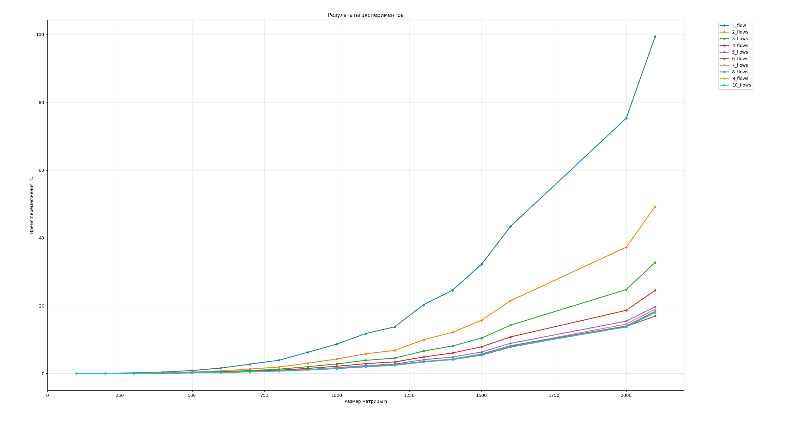

# LAB №1 REPORT

## Задание:

Модифицировать программу из л/р №1 для параллельной работы по технологии OpenMP. Провести серию экспериментов с разным количеством потоков (1, 2, 4, 8 и т.д.), разными размерами матриц (примерно 200, 400, 800, 1200, 1600, 2000), с разным количеством вычислительных ядер при наличии технической возможности (1, 2, 4, 8 и т.д. ), иначе использовать фиксированное существующее количество вычислительных ядер, например 4.

## Исходный код

Представлен в файлах main.cpp, Matrix.h для языка C++ и в файле верификации calculation_verification.py для языка Python  
Построение графиков происходит в файле graph.py

## Результаты экспериментов:

На _графике_ (см. приложение) наблюдается увеличение производительности перемножения матриц при переходе от:  
1 потока к 2, от 2 к 3, от 3 к 4, от 4 к 5.  
Дальнейшее увеличение числа потоков значительного результата не приносит.

## Выводы

1. Я научился распараллеливать алгоритм перемножения матриц при помощи библиотеке OpenMP
1. При распараллеливании на 7 потоков и более скорость перемножения матриц не увеличивается  
   в сравнении с предыдущим результатом.

## Приложение

По мере исследования зависимости времени работы **алгоритма перемножения матриц**  
для различных размерностей n и различных чисел потоков, была получена следующая _таблица_ и _график_.

### Таблица

| size | 1_flow  | 2_flows | 3_flows | 4_flows | 5_flows | 6_flows | 7_flows | 8_flows | 9_flows | 10_flows |
| ---- | ------- | ------- | ------- | ------- | ------- | ------- | ------- | ------- | ------- | -------- |
| 100  | 0.0072  | 0.0036  | 0.0028  | 0.0022  | 0.0018  | 0.0024  | 0.0022  | 0.0050  | 0.0018  | 0.0026   |
| 200  | 0.0522  | 0.0256  | 0.0172  | 0.0134  | 0.0120  | 0.0152  | 0.0160  | 0.0146  | 0.0132  | 0.0134   |
| 300  | 0.1796  | 0.0906  | 0.0630  | 0.0468  | 0.0426  | 0.0362  | 0.0532  | 0.0480  | 0.0490  | 0.0438   |
| 400  | 0.4212  | 0.2104  | 0.1426  | 0.1088  | 0.0958  | 0.0884  | 0.0970  | 0.0972  | 0.0954  | 0.0936   |
| 500  | 0.8796  | 0.4344  | 0.2918  | 0.2218  | 0.1804  | 0.1604  | 0.2024  | 0.1904  | 0.1944  | 0.1890   |
| 600  | 1.6000  | 0.7882  | 0.5308  | 0.4026  | 0.3300  | 0.2964  | 0.3304  | 0.2956  | 0.3496  | 0.3188   |
| 700  | 2.7646  | 1.3156  | 0.8788  | 0.6616  | 0.5424  | 0.4838  | 0.5198  | 0.5120  | 0.5324  | 0.5290   |
| 800  | 3.8878  | 1.9026  | 1.2736  | 0.9704  | 0.7914  | 0.7312  | 0.7434  | 0.7458  | 0.7414  | 0.7320   |
| 900  | 6.2654  | 3.0254  | 1.9978  | 1.4966  | 1.1910  | 1.0420  | 1.1264  | 1.1046  | 1.0732  | 1.0678   |
| 1000 | 8.6750  | 4.2782  | 2.8228  | 2.1236  | 1.6914  | 1.4424  | 1.5062  | 1.4904  | 1.4876  | 1.4464   |
| 1100 | 11.7768 | 5.8136  | 3.8788  | 2.9096  | 2.3338  | 1.9604  | 2.1190  | 2.0492  | 2.0004  | 2.0190   |
| 1200 | 13.7666 | 6.7986  | 4.5348  | 3.4144  | 2.7756  | 2.4100  | 2.5744  | 2.4992  | 2.4472  | 2.4734   |
| 1300 | 20.3050 | 9.9732  | 6.6128  | 4.8764  | 4.0586  | 3.3758  | 3.5578  | 3.4962  | 3.3486  | 3.4822   |
| 1400 | 24.5670 | 12.1566 | 8.1234  | 6.0558  | 4.8560  | 4.0838  | 4.2728  | 4.1200  | 4.0778  | 4.1520   |
| 1500 | 32.1938 | 15.7054 | 10.4334 | 7.8786  | 6.3466  | 5.4264  | 5.7890  | 5.7220  | 5.5724  | 5.5664   |
| 1600 | 43.3700 | 21.4552 | 14.2340 | 10.7842 | 8.8784  | 7.7868  | 8.1304  | 8.2074  | 7.9228  | 7.9356   |
| 2000 | 75.2918 | 37.2518 | 24.7614 | 18.6242 | 15.4442 | 13.8898 | 14.5668 | 14.0240 | 13.7018 | 13.7540  |
| 2100 | 99.4030 | 49.2744 | 32.7730 | 24.5236 | 19.7006 | 16.9204 | 18.9176 | 18.3502 | 18.0732 | 17.9344  |

### График

