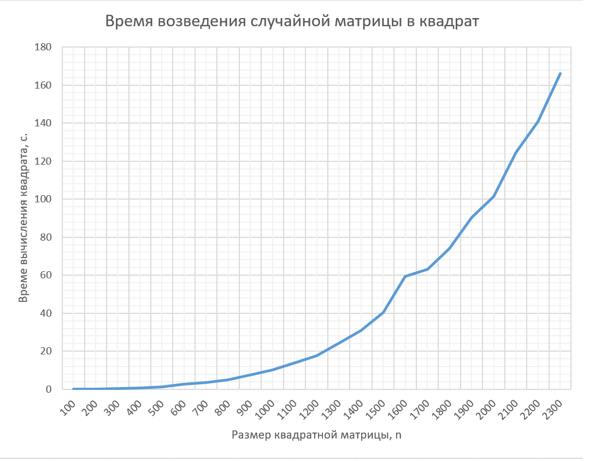

# LAB №1 REPORT

## Задание:

Написать программу на языке C/C++ для перемножения двух квадратных матриц.  
Исходные данные: файл(ы) содержащие значения исходных матриц.  
Выходные данные: файл со значениями результирующей матрицы, время выполнения, объем задачи.  
Обязательна автоматизированная верификация результатов вычислений с помощью сторонних библиотек или стороннего ПО (например на Matlab/Python).

## Исходный код

Представлен в файлах main.cpp, Matrix.h для языка C++ и в файле верификации calculation_verification.py для языка Python

## Результаты экспериментов:

В результате экспериментов была отмечена правильность алгоритма перемножения матриц для языка С++,  
подтвеждённая путем аналогичных вычислений на языке Python и последующим сравнением результатов.  
А также **обнаружена нелинейная зависимость времени работы программы от входного параметра n**.  
Из теоретических соображений сложность перемножения матриц есть O(n^3).  
Исходя из данных, приведённых в _таблице_ и построенного _графика_ теория оказалась верна.  
Действительно, возьмём n1 = 200, и n2 = 400. В силу того, что n2/n1=2, то (n2/n1)^3 = 8, т.е. времена  
должны отличаться в 8 раз. Что и видно из таблицы: 0,079 ~ 0,08 ; 0,08 \* 8 = 0,64 ; 0,573 достаточно близка к 0,64 что и требовалось показать.
| Размер, n | Время, с |
| --------- | -------- |
| 200 | 0,079 |
| 400 | 0,573 |

## Выводы

1. Я научился перемножать матрицы на языке C++ и проверять правильность выполнения операций путём  
   специализированных библиотек языка Python.
1. Сложность алгоритма перемножения квадратных матриц O(n^3)

## Приложение

По мере исследования зависимости времени работы **алгоритма перемножения матриц**  
для различных размерностей n **без распараллеливания**, была получена следующая _таблица_ и _график_.

### Таблица

| Размер, n | Время, с |
| --------- | -------- |
| 100       | 0,009    |
| 200       | 0,079    |
| 300       | 0,238    |
| 400       | 0,573    |
| 500       | 1,196    |
| 600       | 2,70     |
| 700       | 3,657    |
| 800       | 5,097    |
| 900       | 7,566    |
| 1000      | 10,194   |
| 1100      | 13,767   |
| 1200      | 17,717   |
| 1300      | 24,357   |
| 1400      | 30,932   |
| 1500      | 40,265   |
| 1600      | 59,255   |
| 1700      | 62,982   |
| 1800      | 73,96    |
| 1900      | 90,449   |
| 2000      | 101,286  |
| 2100      | 124,594  |
| 2200      | 140,786  |
| 2300      | 166,001  |

### График

