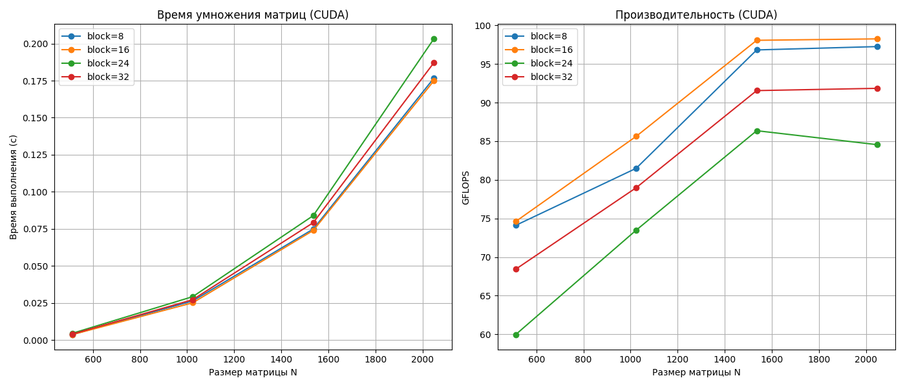

# Отчёт: Умножение двух квадратных матриц на C++ по технологии CUDA

**Цель:** Написать программу на C++ для умножения матриц по технологии CUDA, обеспечить ввод/вывод через файлы, измерение времени и объёма задачи, автоматизированную верификацию на Python + NumPy, провести эксперименты для размеров 512-2048.

## 1. Описание решения

### Программа на C++

- **Вход:** два файла `matrixA_N.txt` и `matrixB_N.txt` (матрицы хранятся построчно, через пробел, без заголовка с N).
- **Выход:** файл `result_N.txt` (результирующая матрица), плюс в консоль:
  - Время выполнения умножения.
  - Размер матрицы N × N.
  - Объём задачи (N³ операций).
- Компиляция: `nvcc -o matrix_mul_cuda.exe matrix_mul_cuda.cu`.

### Автоматизированная верификация

Отдельный скрипт `verify.py` загружает матрицы через **NumPy**, вычисляет `A @ B` и сравнивает с результатом C++ (`np.allclose` с `atol=1e-5`).  
Если расхождение > 1e-5 — выводит максимальную ошибку.

### Эксперименты

Размеры: **512,1024,1536,2048**.  
Для каждого размера:

1. Генерируются случайные матрицы.
2. Запускается `matrix_mul_cuda.exe`.
3. Замеряется время.
4. Выполняется верификация.

Скрипт `run_cuda_experiments.py` полностью автоматизирует процесс и сохраняет `cuda_results.csv` + график `cuda_performance.png`.

## Результаты экспериментов

### Таблица времени выполнения

Было проведено умножение квадратных матриц размера от 200 до 2000. Время замерялось c помощью стандартной оптимизации

| Размер матрицы | Время (с)   | Размер блока | Кол-во операций | GFLOPS            |
| -------------- | ----------- | ------------ | --------------- | ----------------- |
| 512            | 0.00362272  | 8х8          | 134217728       | 74.09776521508701 |
| 512            | 0.003598349 | 16х16        | 134217728       | 74.59961665752822 |
| 512            | 0.004477517 | 24х24        | 134217728       | 59.95185635252753 |
| 512            | 0.003923558 | 32х32        | 134217728       | 68.41633435774366 |
| 1024           | 0.02635202  | 8х8          | 1073741824      | 81.49218344551954 |
| 1024           | 0.02507912  | 16х16        | 1073741824      | 85.62834932007183 |
| 1024           | 0.02922577  | 24х24        | 1073741824      | 73.47911271456663 |
| 1024           | 0.02719192  | 32х32        | 1073741824      | 78.9750649457633  |
| 1536           | 0.07485616  | 8х8          | 3623878656      | 96.82245672233253 |
| 1536           | 0.07390387  | 16х16        | 3623878656      | 98.07006469349982 |
| 1536           | 0.0839228   | 24х24        | 3623878656      | 86.36219611357104 |
| 1536           | 0.07916183  | 32х32        | 3623878656      | 91.55621228059027 |
| 2048           | 0.1766427   | 8х8          | 8589934592      | 97.25773657218781 |
| 2048           | 0.1748488   | 16х16        | 8589934592      | 98.25557386724988 |
| 2048           | 0.2031888   | 24х24        | 8589934592      | 84.55126062066412 |
| 2048           | 0.1870425   | 32х32        | 8589934592      | 91.85008318430305 |

### График

### Вывод

- Использование разделяемой памяти в CUDA-ядре позволяет существенно ускорить умножение матриц по сравнению с прямой работой с глобальной памятью.
- Конфигурация блока 16×16 является оптимальной для данного класса задач на GPU GeForce GTX 1050. Блоки с размером, не кратным 32, неэффективны.
- Полученная производительность (~98 GFLOPS) подтверждает высокую вычислительную мощность GPU даже для операций с двойной точностью.
